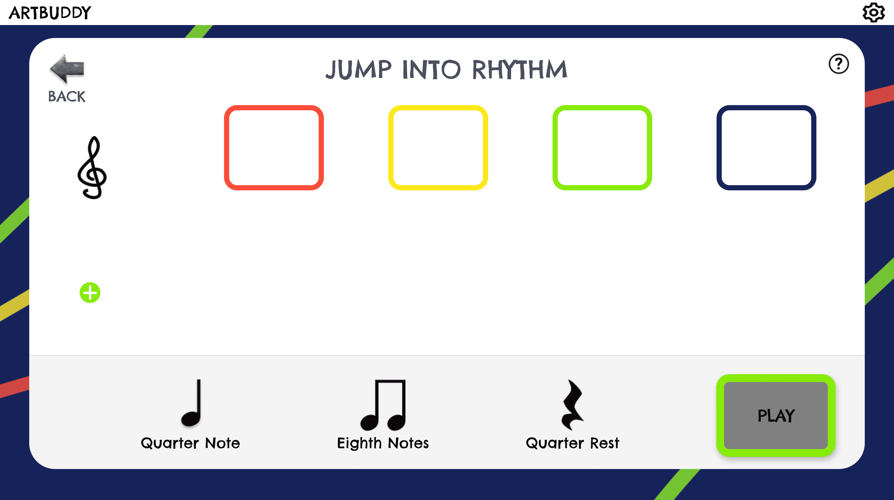
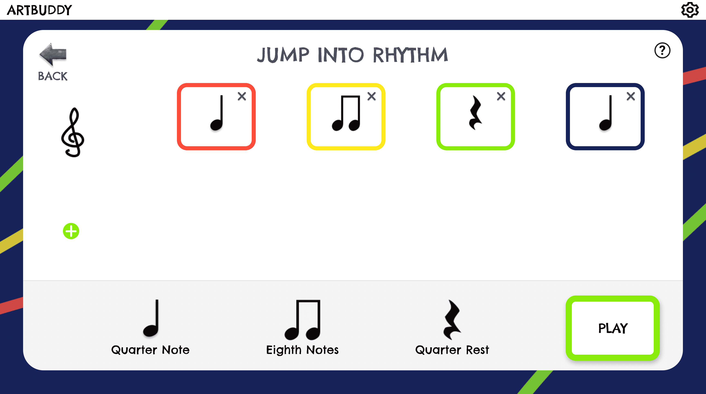
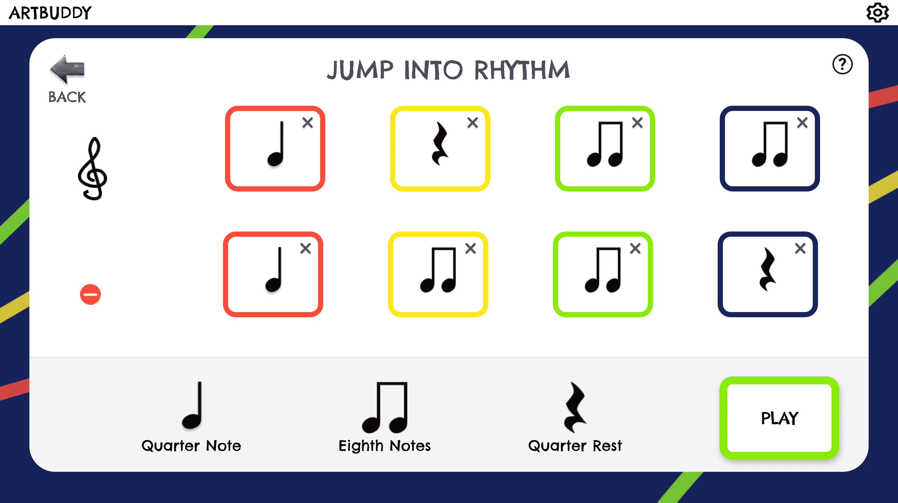
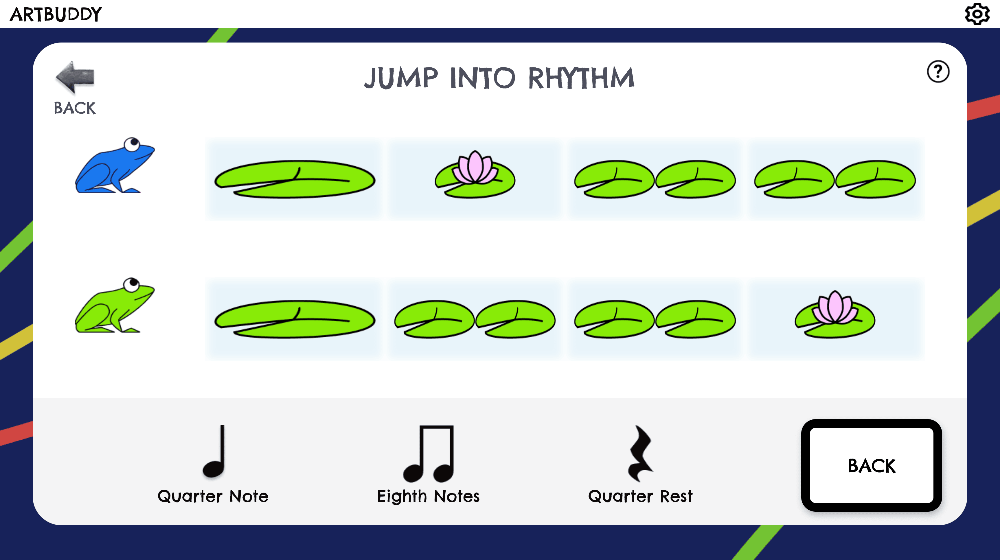

# Jump Into Rhythm

## Purpose
This app allows students to write a rhythm and create frog animations that jump according to the rhythm.

## Other Relevant Directories (all under `src`)

Helper functions: `_utils/jump-into-rhythm`  
Redux reducer: `_redux/jump-into-rhythm`  
The note info object: `_data/jump-into-rhythm/noteInfo.js`
Play context: `_context/PlayContext.js`

## Basic flow

1. Select notes from the bottom bar (`NoteOptions.js`) to render in the colored measures (`Notes.js`)

2. Press the Play button (`NoteOptions.js`) and watch the frogs jump! (`FrogLilyPad.js`). Press the back button below to return to the notes screen.

3. You can create up to four rhythms (scroll to see the rest - currently working on a more obvious scroller)

## How animation is handled

Animations are created dynamically using the animate function that's built in to most HTML elements. See `createAnimation.js` to see how properties and attributes are manipulated.