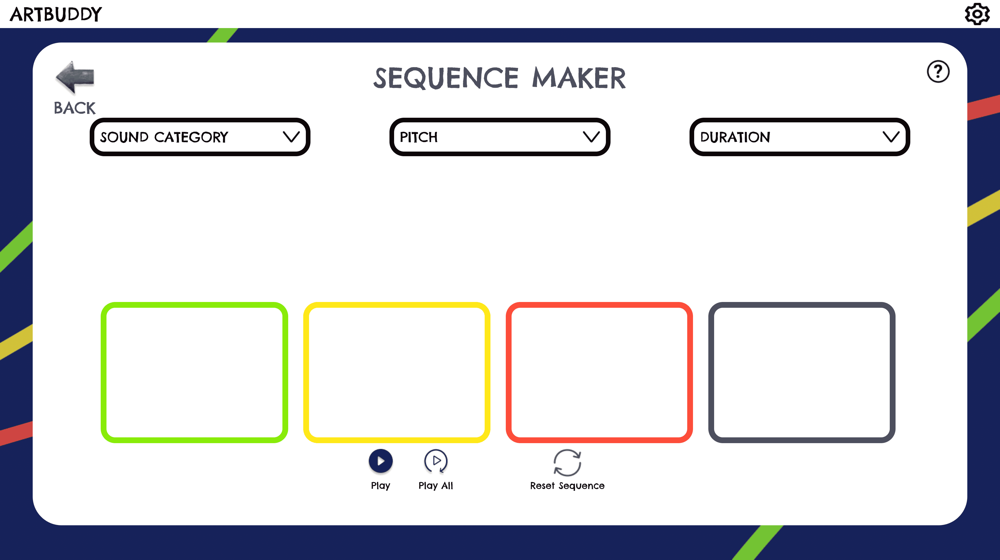
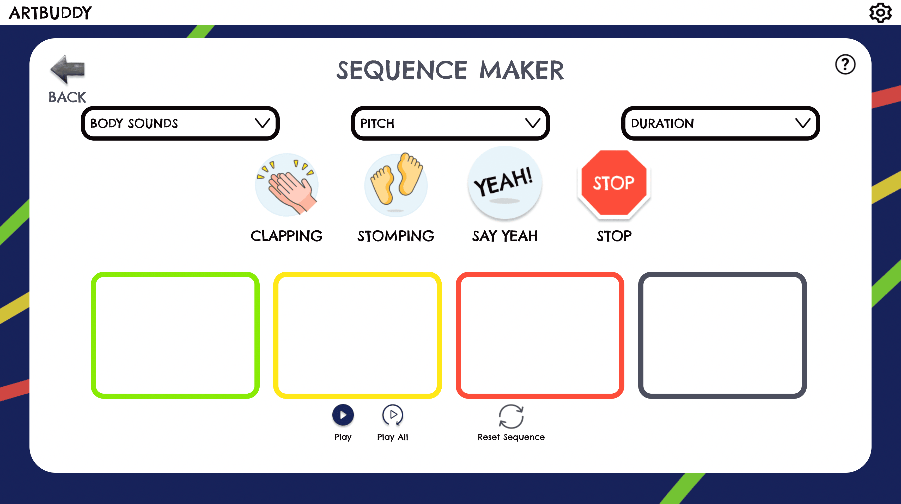
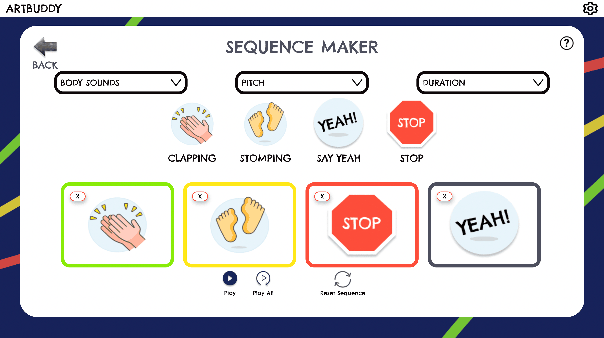
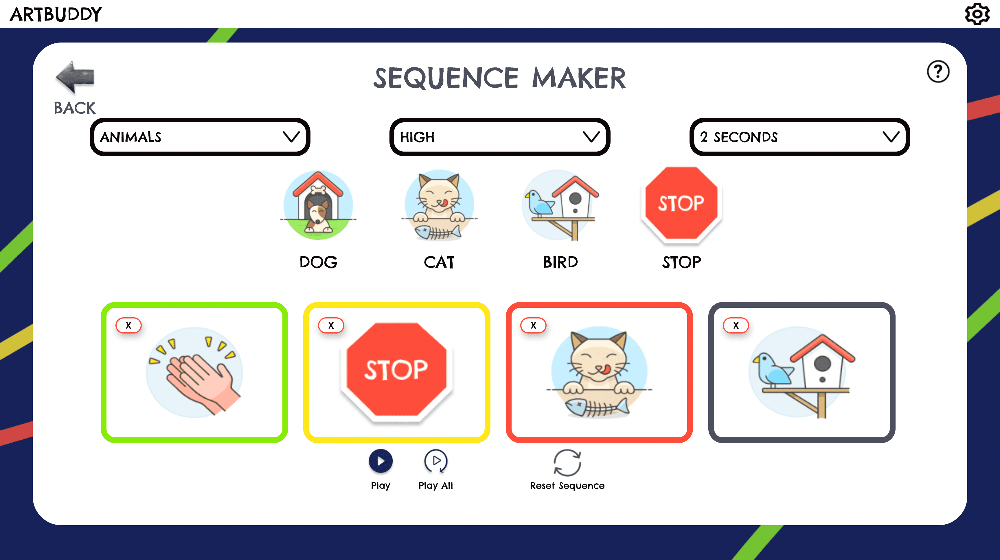

# Sequence Maker

## Purpose

This app allows students to create sequences of different sounds.

## Other Relevant Directories (all under `src`)

Helper functions: `_utils/sequence-maker`  
Redux reducer: `_redux/sequence-maker`  
The soundInfo object: `_data/sequence-maker/soundInfo.js`
Play context: `_context/PlayContext.js`

## Basic flow

1. Pick a category from the dropdown (`SequenceControl.js`). It will show below the dropdowns (`SoundOptions.js`)

2. Select the sequence you want to play in, which will show in the blocks below (`Sequence.js`)

3. Press the Play or Play All buttons below (`SequencePlayReset.js`) and hear what you get! Default pitch is medium and default duration is 3 seconds

4. You can also change the pitch and duration as well as mix and match categories

## How sound is manipulated

Samples are loaded with C3 set as the base pitch, with higher pitches set by changing the octave of C (i.e. high pitch is C4) and durations set by changing the sample play length.